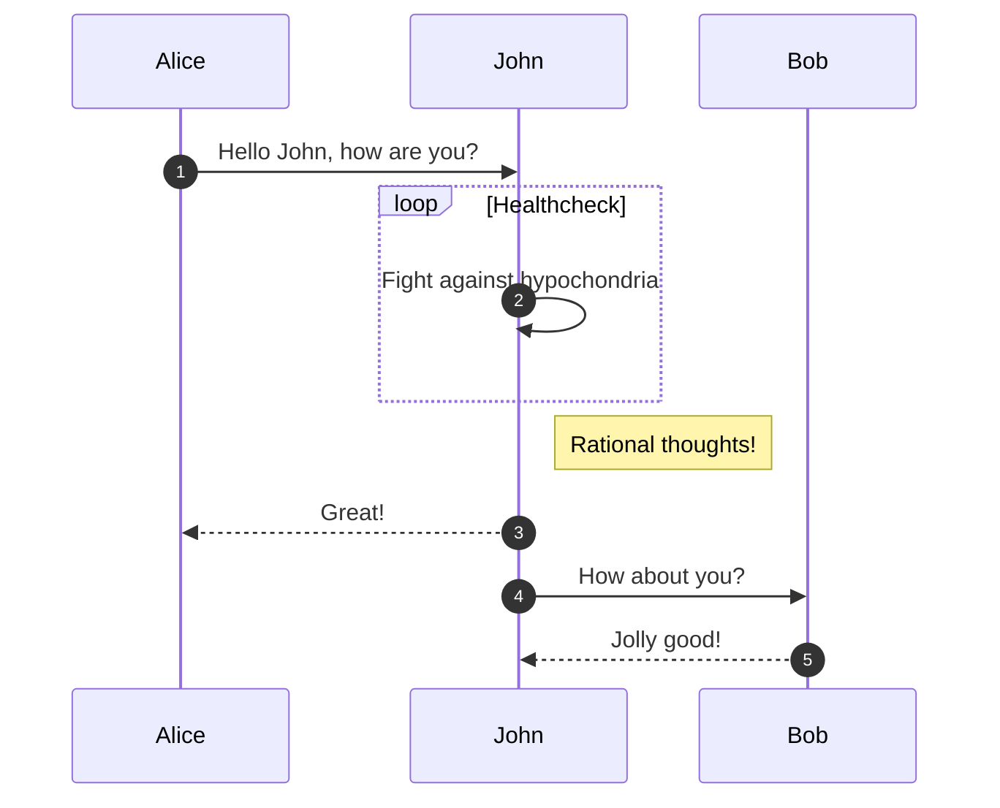
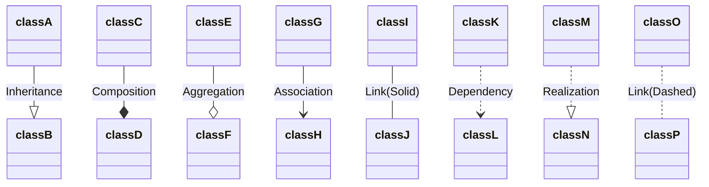
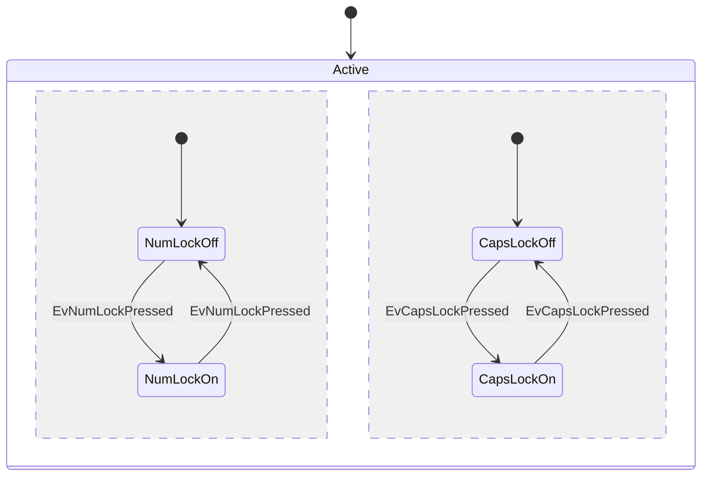

# mermaid-example

```mermaid
sequenceDiagram
    autonumber
    Alice->>John: Hello John, how are you?
    loop Healthcheck
        John->>John: Fight against hypochondria
    end
    Note right of John: Rational thoughts!
    John-->>Alice: Great!
    John->>Bob: How about you?
    Bob-->>John: Jolly good!
```

```mermaid
classDiagram
    classA --|> classB : Inheritance
    classC --* classD : Composition
    classE --o classF : Aggregation
    classG --> classH : Association
    classI -- classJ : Link(Solid)
    classK ..> classL : Dependency
    classM ..|> classN : Realization
    classO .. classP : Link(Dashed)
```

```mermaid
stateDiagram-v2
    [*] --> Active

    state Active {
        [*] --> NumLockOff
        NumLockOff --> NumLockOn : EvNumLockPressed
        NumLockOn --> NumLockOff : EvNumLockPressed
        --
        [*] --> CapsLockOff
        CapsLockOff --> CapsLockOn : EvCapsLockPressed
        CapsLockOn --> CapsLockOff : EvCapsLockPressed
    }
```