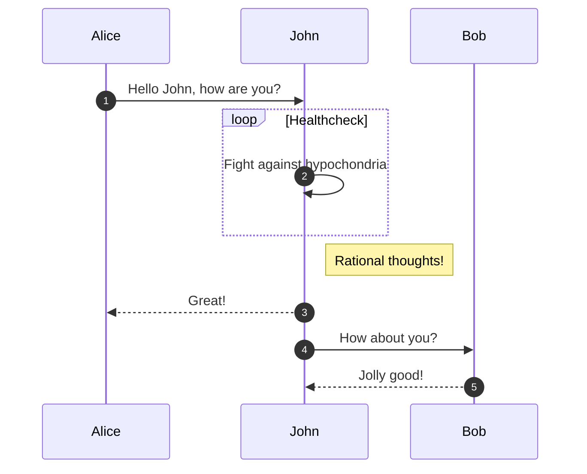
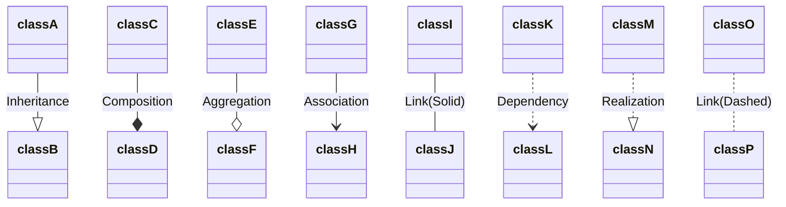
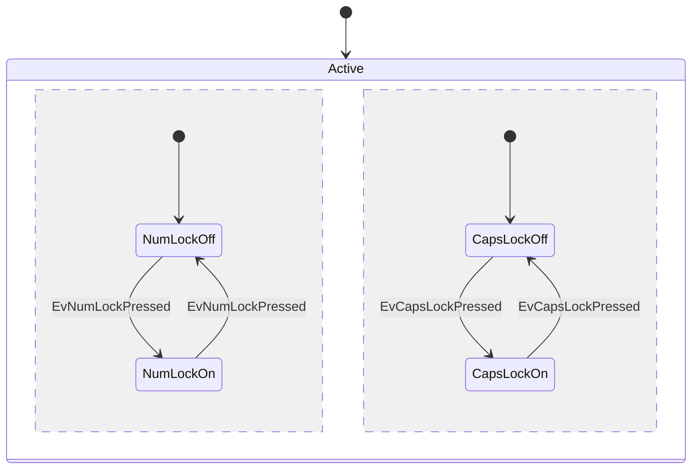
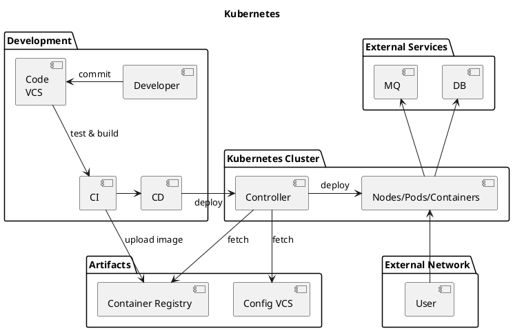
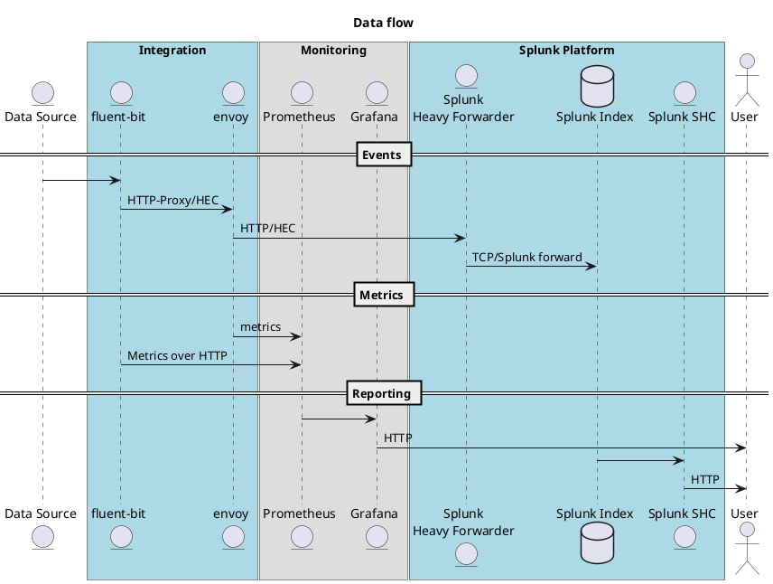
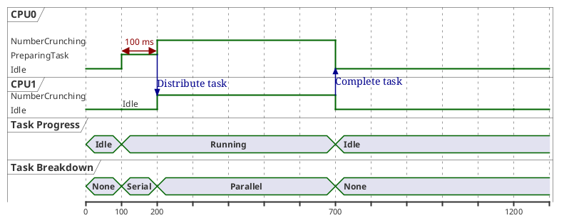
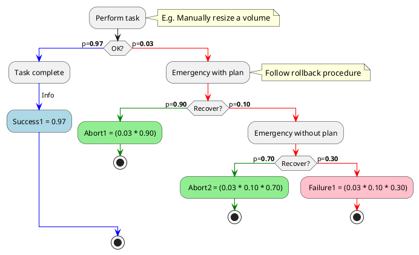

# mermaid







# platuml

## component


## sequence


## timing


## graph
```plantuml
digraph G {

  {node [label="Developer" style=filled color=skyblue] d1 d2 d3 d4 d5 }

  d1 -> d2 [len=2];
  d1 -> d3 [len=2];
  d1 -> d4 [len=2];
  d1 -> d5 [len=2];

  d2 -> d1 [len=2];
  d2 -> d3 [len=2];
  d2 -> d4 [len=2];
  d2 -> d5 [len=2];

  d3 -> d1 [len=2];
  d3 -> d2 [len=2];
  d3 -> d4 [len=2];
  d3 -> d5 [len=2];

  d4 -> d1 [len=2];
  d4 -> d2 [len=2];
  d4 -> d3 [len=2];
  d4 -> d5 [len=2];

  d5 -> d1 [len=2];
  d5 -> d2 [len=2];
  d5 -> d3 [len=2];
  d5 -> d4 [len=2];

}
```

## flow



## C4 example - container
```plantuml
@startuml
 
!include C4-PlantUML/C4_Container.puml
!define ICONS https://raw.githubusercontent.com/tupadr3/plantuml-icon-font-sprites/master/
 
!include ICONS/font-awesome-5/user_tie.puml
 
LAYOUT_AS_SKETCH()
LAYOUT_LEFT_RIGHT()
LAYOUT_WITH_LEGEND()
 
System_Ext(cc, "Contact Center", "Contact point, switches customer calls.")
Person_Ext(manager, "Manager", "Makes a decision from statistics provided by CLOVA AiCall", "user_tie")
 
System_Boundary(clova_ai_call, "CLOVA AiCall") {
 
  Container(pa, "Protocol Adapter", "SIP, gRPC client", "Converts voice streams into supported format.")
  Container(vsg, "Voice Streaming Gateway", "gRPC server", "Manages call sessions and handle voice streaming.")
  Container(cic, "CIC", "CIC Protocol", "Processes AI requests")
  Container(interface, "AiCall Interface", "Kafka, REST API", "Provides interfaces for AiCall console")
  Container(console, "AiCall Console", "Web app", "Provides UI for retrieving statistics.")
  ContainerDb(db, "Database", "Redis, MySQL", "Stores activities, events, and call information")
       
  Rel(cc, pa, "Forwards voice stream data to", "SIP trunk")
  Rel_L(pa, vsg, "Forwards converted voice stream to", "gRPC call")
 
  Rel(vsg, cic, "Requests voice recognition and processing corresponding works to", "REST/HTTPS 2.0")
  Rel(vsg, interface, "Sends event log to", "REST API call")
  Rel(manager, console, "Retrieves statistics from", "HTTP")
  Rel(console, interface, "Queries statistic data from", "REST API call")
 
  Rel_L(interface, db, "Reads from and writes to", "JDBC")
}
 
@enduml
```


## C4 example - component
```plantuml
@startuml
 
!include C4-PlantUML/C4_Component.puml
!define ICONS https://raw.githubusercontent.com/tupadr3/plantuml-icon-font-sprites/master/
 
!include ICONS/govicons/user_suit.puml
!include ICONS/font-awesome-5/user_tie.puml
!include ICONS/material/dialer_sip.puml
 
LAYOUT_AS_SKETCH()
LAYOUT_WITH_LEGEND()
 
Container_Ext(vsg, "Voice Streaming Gateway", "gRPC server", "Manages call sessions and handle voice streaming.")
Container_Ext(console, "AiCall Console", "Web app", "Provides UI for retrieving statistics.")
ContainerDb_Ext(db, "Database", "Redis, MySQL", "Stores activities, events, and call information")
 
Container_Boundary(ai_call_interface, "AiCall Interface") {
 
  Component(signin, "Sign In Controller", "Spring MVC REST Controller", "Allows users to sign in to AiCall Console.")
  Component(query, "Query Controller", "Spring MVC REST Controller", "Allows users to Retrieves statistics data with query.")
  Component(log, "Event Log Controller", "Spring MVC REST Controller", "Allows other components to store their events logs to DB.")
  Component(auth, "Auth Component", "Spring Bean", "Provides functionality related to authentication")
  Component(db_control, "DB Controller", "Spring Bean", "Provides functionality related to DB access.")
 
}
 
Rel(vsg, log, "Makes API calls to", "JSON/HTTPS")
Rel_R(console, signin, "Makes API calls to", "JSON/HTTPS")
Rel_R(console, query, "Makes API calls to", "JSON/HTTPS")
Rel(signin, auth, "Uses")
Rel(query, db_control, "Uses")
Rel(log, db_control, "Uses")
Rel(auth, db_control, "Uses")
Rel(auth, db_control, "Uses")
Rel(db_control, db, "Reads from and writes to", "JDBC")
 
@enduml
```